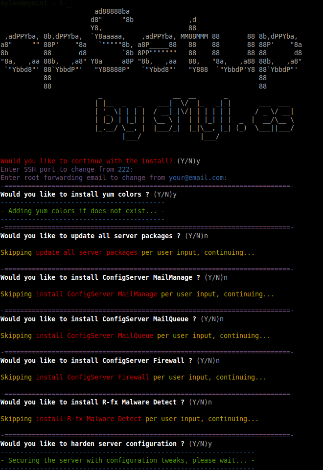

cpSetup
=======

<strong>Author:</strong> Myles McNamara<br/>
<strong>Version:</strong> 1.3.0<br/>
<strong>Last Update:</strong> June 2, 2015

<strong>cpsetup</strong> is a custom bash/shell script to setup and harden/configure cPanel CentOS/RHEL server with a wide range of applications, plugins, and modules.

Each installation and configuration/hardening is organized into functions. By default running the script without any arguments will prompt for each install/configuration as well as prompt for any required configs (email, api key, etc).

You can also run any of the available functions individually ... to see a list of functions available, execute this command:
```bash
./cpsetup --functions
```
Usage
===
```bash
wget https://raw.githubusercontent.com/tripflex/cpsetup/master/cpsetup
chmod +x cpsetup
./cpsetup
```

<table border="0">
<tr>
<td width="60%">
<h4>Features Include:</h4>
<ul>
<li>Install ClamAV from Source</li>
<li>Install <a href="http://configserver.com/cp/cmm.html" target="_blank">ConfigServer MailManage</a></li>
<li>Install <a href="http://configserver.com/cp/cmq.html" target="_blank">ConfigServer MailQueues</a></li>
<li>Install <a href="http://configserver.com/cp/csf.html" target="_blank">ConfigServer Firewall</a></li>
<li>Install <a href="https://www.rfxn.com/projects/linux-malware-detect/" target="_blank">R-fx Malware Detect</a></li>
<li>Install <a href="https://www.ndchost.com/cpanel-whm/addons/accountdnscheck/" target="_blank">Account DNS Check</a></li>
<li>Install <a href="http://www.softaculous.com/" target="_blank">Softaculous</a></li>
<li>Install <a href="https://www.ndchost.com/cpanel-whm/addons/watchmysql/" target="_blank">WatchMySQL</a></li>
<li>Install <a href="http://how2.be/en/community/phpinimgr/" target="_blank">PHP.ini Manager</a></li>
<li>Install <a href="https://www.ndchost.com/cpanel-whm/addons/cleanbackups/" target="_blank">Clean Backups</a></li>
<li>Install <a href="https://github.com/major/MySQLTuner-perl" target="_blank">MySQL Tuner</a></li>
<li>Install Apache mod_cloudflare</li>
<li>Install CloudFlare RailGun</li>
<li>Install yum terminal colors</li>
<li>Configure/Setup CloudFlare RailGun</li>
<li>Configure CloudFlare RailGun and MemCached (using socket)</li>
<li>Update Firewall Allow list with CloudFlare IPs</li>
<li>Update Firewall Configuration</li>
<li>Update SSH Configuration ( Port, and UseDNS )</li>
<li>Update cPanel Configurations</li>
<li>Update Pure FTP Configurations</li>
<li>Update cPanel Tweak Settings</li>
<li>Update MySQL Settings</li>
<li>Update PHP Settings</li>
<li>Update Apache Global Configuration</li>
</ul>
<h4>Future Enhancements:</h4>
<ul>
<li>You tell me, open up an issue and suggest a new feature!</li>
</ul>
</td>
<td width="40%">
<p align="center"></p>
</td>
</tr>
</table>

Available Arguments
-------------------

```
cpsetup - sMyles cPanel Setup Script
Usage example:
cpsetup [(-h|--help)] [(-v|--verbose)] [(-V|--version)] [(-u|--unattended)] [(-r|--run)] [(-R|--functions)]
Options:
-h or --help: Displays this information.
-v or --verbose: Verbose mode on.
-V or --version: Displays the current version number.
-u or --unattended: Unattended installation ( bypasses all prompts ).
-m or --menu: Show interactive UI menu (NOT yet implimented)
-r or --run: Run a specific function.
-R or --functions: Show available functions to use with -r or --run command.
```


Firewall Updates
----------------

Option | Original Value | New Value
--- | --- | ---
`RESTRICT_SYSLOG` | 0 | 3
`SMTP_BLOCK` | 0 | 1
`LF_SCRIPT_ALERT` | 0 | 1
`SYSLOG_CHECK` | 0 | 1800
`PT_ALL_USERS` | 0 | 1

SSH Updates
----------------
Any options that have `(prompt)` means you will be prompted to specify your own custom value if `-u` was not used as an argument.

Option | Original Value | New Value
--- | --- | ---
`Port` | 22 | 222 (prompt)
`UseDNS` | yes | no


cPanel Config Updates
----------------

Option | Original Value | New Value
--- | --- | ---
Shell Fork Bomb Protection | Disabled | Enabled
Compiler Access | Enabled | Disabled
Root Forwarder Email | None | User Specified (prompt)


Pure FTP Updates
----------------

Option | Original Value | New Value | Result
--- | --- | --- | ---
`RootPassLogins` | yes | no | Can't login with root pw
`AnonymousCantUpload` | no | yes | Anonymous can't upload
`NoAnonymous` | no | yes | Anonymous can't login


cPanel Tweak Settings Updates
-----------------------------

Option | Original Value | New Value
--- | --- | ---
BoxTrapper | Enabled | Disabled
Referrer Blank Sanity Check | Disabled | Enabled
Referrer Safety Check | Disabled | Enabled
Hide Login PW from CGI Scripts | Disabled | Enabled
Max Emails Account Can Send Per Hour | Unlimited | 199


MySQL Settings Updates
-----------------------

Option | Original Value | New Value
--- | --- | ---
local-infile | 1 | 0


PHP Configuration Updates
--------------------------

Option | Original Value | New Value
--- | --- | ---
enable_dl | On | Off
disable_functions | None | show_source, system, shell_exec, passthru, exec, phpinfo, popen, proc_open, allow_url_fopen, ini_set

Apache Global Configuration Updates
-----------------------------------

Option | Original Value | New Value
--- | --- | ---
Server Signature | On | Off
Server Tokens | All | ProductOnly
Trace Enable | On | Off

CloudFlare RailGun Configuration
-----------------------------------

Option | Original Value | New Value
--- | --- | ---
memcached.servers | /tmp/memcached.sock | /var/run/memcached/memcached.sock
activation.railgun_host | YOUR_PUBLIC_IP_OR_HOSTNAME | (user defined)
activation.token | YOUR_TOKEN_HERE | (user defined)

CloudFlare RailGun MemCached Configurations
-----------------------------------

Option | Original Value | New Value
--- | --- | ---
PORT | 11211 | 22222
USER | memcached | memcached
MAXCONN | 1024 | 20480
CACHESIZE | 64 | 4096
OPTIONS |  | -s /var/run/memcached/memcached.sock

### Caution
Use at your own risk, if you don't know what you're doing you should probably not be using this script.  Myself and any contributors to this project take absolutely no responsibility for anything you do with this script. I **strongly** recommend reading the script so you understand what it does before using.
